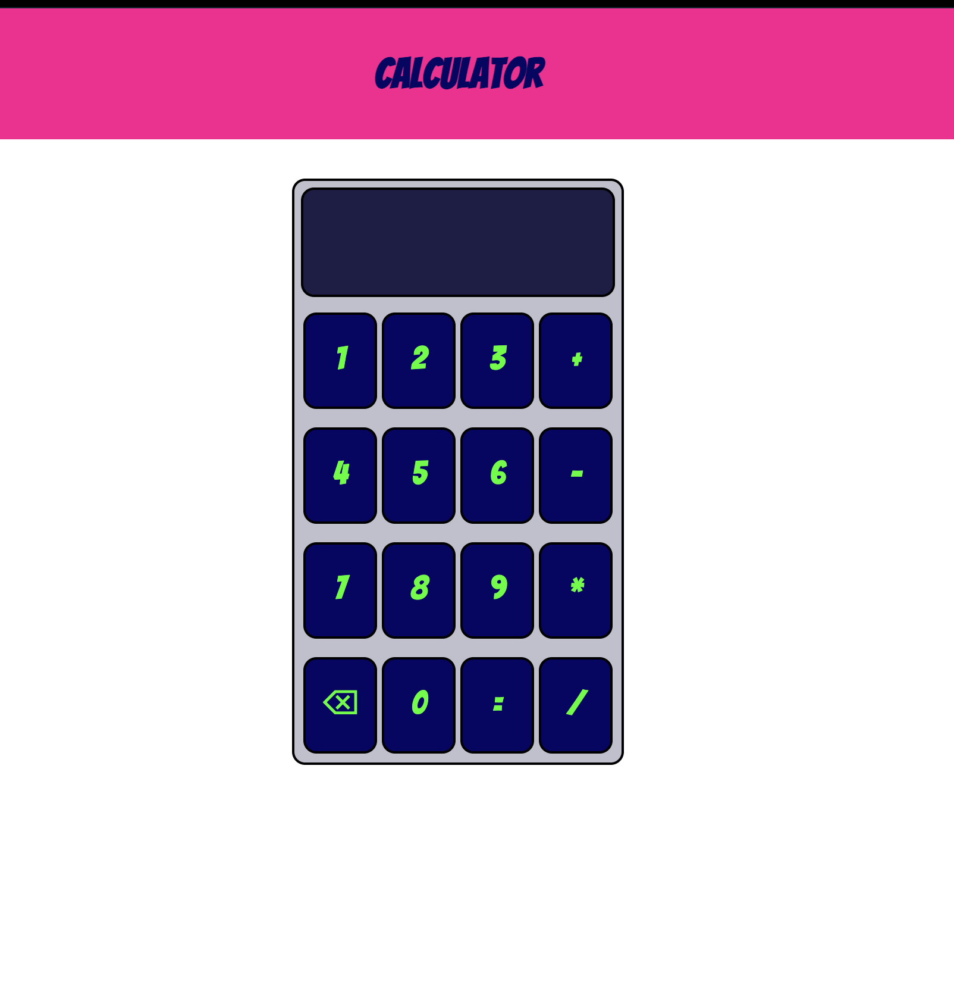

# 🧮 Calculator Web App

A simple and responsive calculator built using **HTML, CSS, and JavaScript**.

## 🚀 Features

* Basic arithmetic operations (+, -, *, /)
* Backspace functionality (⌫)
* Error handling
* Clean UI with custom styling

## 🛠️ Tech Stack

* HTML
* CSS
* JavaScript (DOM Manipulation)

## 📸 Screenshot

## 📌 Future Improvements

* Add keyboard support
* Add decimal operations
* Replace `eval()` with safer logic
* Dark/Light mode toggle
